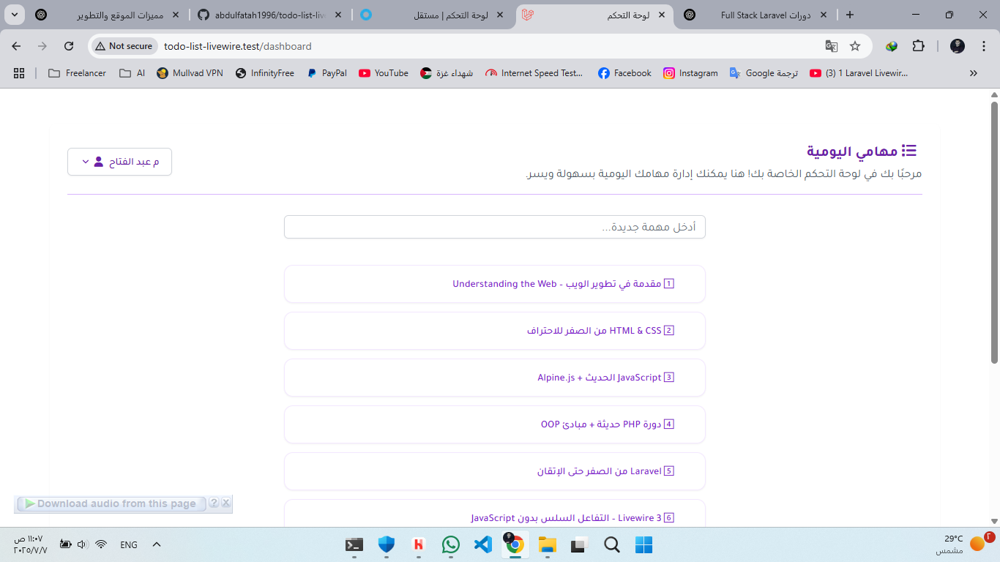

# ToDo List Livewire

A modern and interactive task management web app built using **Laravel 12**, **Livewire 3**, and **Tailwind CSS**. This project helps users stay productive by allowing them to manage and prioritize their tasks in real-time through a clean and responsive interface.

---

## Screenshots

<p align="center">
  
  <br><small> Dashboard View</small>
</p>

---

## Features

- Create tasks with title, description, priority, and due date
- Mark tasks as complete or pending
- Drag and drop to reorder tasks
- Real-time updates with Livewire 3
- Clean UI built with Tailwind CSS
- Toast notifications with sound feedback
- Smart interface (e.g., strike-through completed tasks)
- Fully responsive design for desktop and mobile
- Modular and reusable Blade components

---

## Tech Stack

| Layer      | Technology            |
|------------|------------------------|
| Backend    | Laravel 12             |
| Frontend   | Tailwind CSS, Alpine.js |
| Realtime   | Livewire 3             |
| Icons      | Font Awesome (webfont) |
| Tooling    | Composer, NPM          |

---

## Installation

```bash
# Clone the repository
git clone https://github.com/abdulfatah1996/todo-list-livewire.git

cd todo-list-livewire

# Install PHP dependencies
composer install

# Install front-end dependencies
npm install && npm run buid

# Copy and configure environment
cp .env.example .env
php artisan key:generate

# Setup your .env (database connection)

# Run migrations
php artisan migrate

# Serve the app
php artisan serve
